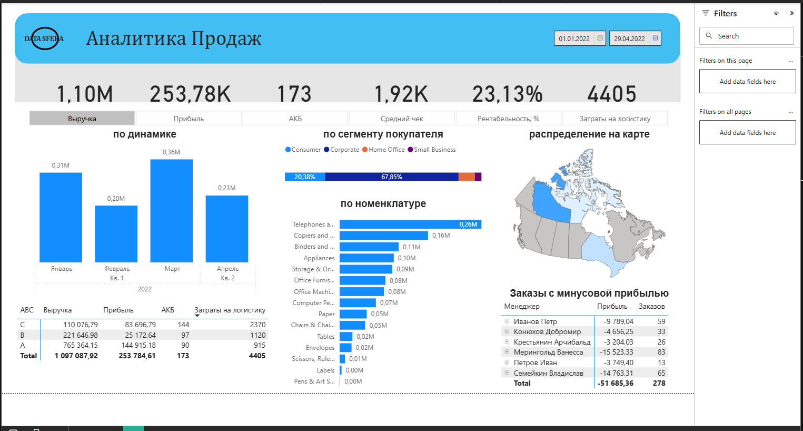

# 📊 Data Analytics Portfolio — Vyacheslav Hong

Hi! I'm a Data Analyst with hands-on experience across the full analytics stack —
SQL, Python, Power BI and Excel. This repository contains my best projects
from a professional Data Analytics programme.

---

## 🗂 Projects

### 📊 Power BI: DATA_SFERA Business Dashboard
**Tools:** Power BI · DAX · Data Modelling  
**Files:** [`Power-BI/DATA_SFERA.pbix`](./Power-BI/DATA_SFERA.pbix) · [`Power-BI/Visualization_project.pbix`](./Power-BI/Visualization_project.pbix)

Built interactive multi-page reports with drill-through navigation and dynamic KPIs.
- KPI scorecards, trend charts and performance tables
- Modelled relationships across multiple data sources
- Applied DAX measures for dynamic calculations

---

### 🤖 Machine Learning: Price Prediction Model
**Tools:** Python · Pandas · Scikit-learn · Matplotlib  
**File:** [`Python/Mini project ML.ipynb`](./Python/Mini%20project%20ML.ipynb)

Built a **Random Forest Regressor** to predict item prices from 4 features (10,000+ rows).
- EDA: correlation heatmap, outlier detection, missing value handling
- Model: 80/20 train-test split, R² = 0.65, MAE = 98.6
- Visualised feature importance and actual vs predicted scatter plot

---

### 🐍 Python: Data Analysis & OOP
**Tools:** Python · Pandas · Matplotlib · Seaborn  
**File:** [`Python/Mini project 1.ipynb`](./Python/Mini%20project%201.ipynb)

Exploratory data analysis with object-oriented Python.
- Built a `Users` class with age calculation and filtering methods
- Analysed coffee shop sales: identified top product, weather impact, weekly patterns
- Produced charts with Matplotlib and Seaborn

---

### 🗄 SQL: Advertising Analytics
**Tools:** MySQL · CTEs · Window Functions · HAVING  
**File:** [`SQL/mini project 2.sql`](./SQL/mini%20project%202.sql)

Queried a user ad-view behaviour database with advanced SQL.
- Counted unique users in date ranges, identified top viewers
- Filtered days with >500 unique users using `HAVING`
- Calculated user Lifetime (`MAX date - MIN date`) per user

---

### 🏦 SQL: Banking Cohort Analysis
**Tools:** PostgreSQL · Date Functions · Aggregations  
**File:** [`SQL/SQL task.sql`](./SQL/SQL%20task.sql)

Analysed customer transactions over a 12-month period.
- Identified customers with uninterrupted monthly activity for 12 months
- Computed average cheque, gender ratios (M/F/NA) with spend share
- Segmented customers into 10-year age bands with quarterly breakdowns

---

## 🛠 Tech Stack

| Category | Tools |
|---|---|
| **Languages** | Python 3, SQL |
| **Python libs** | Pandas, NumPy, Matplotlib, Seaborn, Scikit-learn |
| **Databases** | MySQL, PostgreSQL |
| **BI Tools** | Power BI (DAX, Data Modelling) |
| **Excel** | Pivot Tables, VBA Macros, VLOOKUP, Dynamic Charts |
| **Other** | Jupyter Notebook, Git, GitHub |

---

## 📬 Contact

- **Email:** slavakhon@gmail.com
- **Available for:** Remote freelance · Data Analyst roles · BI/Reporting positions
